# 🎙️ Ollama STT (Speech-to-Text) Application


## 🌟 About

A powerful speech-to-text application that integrates with Ollama AI models for seamless voice interaction

## 🌟 Overview

This project provides two Python applications for speech-to-text conversion that work seamlessly with Ollama AI models:

- **`ollama_stt_app.py`** - Advanced STT application with silence detection
- **`ollama_stt_simple.py`** - Enhanced STT with additional audio processing features
- **`web_portal.py`** - Beautiful web interface for easy STT interaction (NEW! 🌐)

## 🎯 Features

### 🔊 Audio Processing

- **Real-time microphone recording** with automatic silence detection
- **Ambient noise adjustment** for optimal recognition
- **Configurable recording duration** and silence thresholds
- **Multiple audio format support** (via PyDub)

### 🤖 Speech Recognition

- **Google Speech Recognition** (default, online)
- **OpenAI Whisper** support (offline capable)
- **Sphinx** fallback for offline recognition
- **Automatic engine fallback** on failure

### 🚀 Integration

- **Ollama AI model integration** (LLaMA 3.1 ready)
- **Automatic TTS forwarding** to companion scripts
- **Transcription history saving** with timestamps
- **Command-line interface** with full argument support

### 🌐 Web Interface

- **Modern web portal** with beautiful UI on localhost:55667
- **Real-time voice recording** with visual feedback
- **Drag & drop file uploads** for audio transcription
- **Ollama integration** directly from the web interface
- **Transcription history** with easy management
- **Responsive design** for desktop and mobile
- **One-click setup** with automated dependency installation

## 🛠️ Smart Dependencies

- **Automatic package installation** on first run
- **Dependency checking** and error handling
- **Cross-platform compatibility** (Windows optimized)

## 📦 Installation

### ⚡ Automatic Installation (Recommended)

**The application now automatically installs all required dependencies on first run!**

Simply run the application and it will:

- ✅ Check for missing dependencies
- 📦 Automatically install any missing packages
- 🚀 Start the application once everything is ready

### ⚠️ Important: Repository Location

**This repository MUST be located in your Ollama home directory for proper functionality.**

- **Windows**: `C:\Users\{username}\.ollama\`
- **macOS**: `~/.ollama/`
- **Linux**: `~/.ollama/`

The application relies on the Ollama model storage structure and configuration files that are located in the `.ollama` directory. Running from any other location is not guaranteed to work properly.

### Prerequisites

- Python 3.7 or higher
- Ollama installed and running
- Microphone access
- Repository cloned/extracted to your `.ollama` directory

### Quick Start

```bash
# IMPORTANT: Clone to your .ollama directory
# Windows:
cd C:\Users\{username}\.ollama
git clone <repository-url> .

# macOS/Linux:
cd ~/.ollama
git clone <repository-url> .

# Run the web portal (dependencies auto-install!)
python web_portal.py

# Or run the console versions
python ollama_stt_app.py
python ollama_stt_simple.py

# On Windows, you can also use the batch files:
start_portal.bat
# or
run_portal.bat
```

### Manual Installation (Only if needed)

If automatic installation fails, you can manually install dependencies:

```bash
pip install -r requirements.txt
```

Or install packages individually:

```bash
pip install Flask==3.0.0 SpeechRecognition==3.10.0 pyaudio==0.2.11 pydub==0.25.1 Werkzeug==3.0.1
```

## 🎮 Usage

### Basic Usage

```bash
# Start the STT application
python ollama_stt_app.py

# With custom settings
python ollama_stt_app.py --duration 30 --silence-threshold 3.0
```

### Advanced Options

```bash
python ollama_stt_simple.py \
    --duration 60 \
    --silence-threshold 2.0 \
    --engine whisper \
    --model llama3.1:latest \
    --tts_script ollama_tts_app.py \
    --voice default \
    --save-path ~/Documents/transcriptions/ \
    --verbose
```

## 🔧 Configuration

### Command Line Arguments

| Argument | Description | Default |
|----------|-------------|---------|
| `--duration` | Maximum recording duration (seconds) | `60` |
| `--silence-threshold` | Silence detection threshold (seconds) | `2.0` |
| `--engine` | Speech recognition engine | `google` |
| `--model` | Ollama model to use | `llama3.1:latest` |
| `--tts_script` | Path to TTS script | `ollama_tts_app.py` |
| `--voice` | Voice for TTS output | `default` |
| `--save-path` | Custom save path for transcriptions | `~/Documents/SchmidtSims/STTHistory/` |
| `--verbose` | Enable verbose output | `False` |

### Supported Models

- **LLaMA 3.1** (default) - High-quality text processing
- **Custom Ollama models** - Any model available in your Ollama installation

## 🏗️ Architecture

```text
📁 Project Structure
├── 🎙️ ollama_stt_app.py      # Main STT application
├── 🎙️ ollama_stt_simple.py   # Enhanced STT with audio processing
├── 📄 readme                  # This file
├── 🔑 id_xxxxx             # SSH key (private)
├── 🔑 id_xxxxx.pub         # SSH key (public)
└── 📁 models/                # Ollama model storage
    ├── 📁 blobs/             # Model binary data
    └── 📁 manifests/         # Model metadata
        └── 📁 registry.ollama.ai/
            └── 📁 library/
                └── 📁 llama3.1/
                    └── latest # LLaMA 3.1 model manifest
```

## 🔄 Workflow

```mermaid
graph TD
    A[🎤 Start Recording] --> B[🔊 Detect Audio]
    B --> C{Silence > Threshold?}
    C -->|No| B
    C -->|Yes| D[⏹️ Stop Recording]
    D --> E[🔤 Transcribe Audio]
    E --> F[💾 Save Transcription]
    F --> G[🔄 Forward to TTS]
    G --> H[🤖 Ollama Processing]
    H --> I[🔊 Audio Output]
```



## 🎨 Visual Feedback

The application provides rich console output with emojis and status indicators:

- 🎤 **Recording status** - Visual feedback during audio capture
- 🔴 **Recording indicator** - Shows when actively recording
- 🎵 **Audio detection** - Real-time audio level indication
- 🔇 **Silence detection** - Shows when silence is detected
- 📝 **Transcription** - Displays recognized text
- ✅ **Success messages** - Confirmation of operations
- ❌ **Error handling** - Clear error messages and fallbacks

## 🔍 Troubleshooting

### Common Issues

#### Repository Location Error (CRITICAL)

**If you're experiencing issues with model loading or file paths:**

- **Ensure the repository is in your .ollama directory**
- **Windows**: `C:\Users\{username}\.ollama\`
- **macOS/Linux**: `~/.ollama/`
- **Check current directory**: Use `pwd` (Unix) or `cd` (Windows) to verify location
- **Reinstall if needed**: Move the entire repository to the correct location

#### PyAudio Installation Error (Windows)

```bash
pip install --upgrade pip setuptools wheel
pip install pyaudio
```

#### Microphone Not Found

- Check microphone permissions
- Ensure microphone is not used by other applications
- Try running as administrator

#### Ollama Connection Error

- Verify Ollama is running: `ollama serve`
- Check model availability: `ollama list`
- Ensure model is pulled: `ollama pull llama3.1`

## 📊 Performance

- **Recording latency**: < 100ms
- **Transcription speed**: ~2-5 seconds (Google API)
- **Offline recognition**: Available via Sphinx
- **Memory usage**: < 50MB typical
- **Supported audio formats**: WAV, MP3, FLAC, OGG (via PyDub)

## 🤝 Contributing

1. Fork the repository
2. Create a feature branch
3. Make your changes
4. Test thoroughly
5. Submit a pull request

## 📝 License

This project is licensed under the MIT License - see the [LICENSE](LICENSE) file for details.

## 🙏 Acknowledgments

- **Ollama** - For providing excellent local AI model serving
- **SpeechRecognition** - For the robust speech recognition library
- **PyAudio** - For audio capture capabilities
- **OpenAI Whisper** - For offline speech recognition
- **Google Speech API** - For high-quality online recognition

## 📞 Support

For issues, questions, or contributions, please:

- Open an issue on the repository
- Check the troubleshooting section above
- Review the Ollama documentation

---

Made with ❤️ for the Ollama community

## 🌐 Web Portal (NEW!)

Experience the easiest way to use Ollama STT with our beautiful web interface!

### Quick Start Web Portal

```bash
# Windows users - navigate to .ollama directory first:
cd C:\Users\{username}\.ollama
start_portal.bat

# macOS/Linux users:
cd ~/.ollama
pip install -r requirements.txt
python web_portal.py
```

### Web Portal Features

- **🎙️ Voice Recording**: Click to record, automatic transcription
- **📁 File Upload**: Drag & drop audio files for instant transcription
- **🤖 Ollama Integration**: Send transcribed text directly to AI models
- **📊 Live Status**: Real-time system status and health monitoring
- **📝 History**: Complete transcription history with search and management
- **🎨 Beautiful UI**: Modern, responsive design with smooth animations
- **⚡ Real-time**: Instant feedback and processing indicators

### Accessing the Web Portal

1. **Navigate to .ollama directory**: `cd ~/.ollama` (or `cd C:\Users\{username}\.ollama` on Windows)
2. **Start the server**: Run `start_portal.bat` or `python web_portal.py`
3. **Open browser**: Navigate to `http://localhost:55667`
4. **Check status**: Green indicators mean systems are ready
5. **Start transcribing**: Use microphone or upload audio files!
